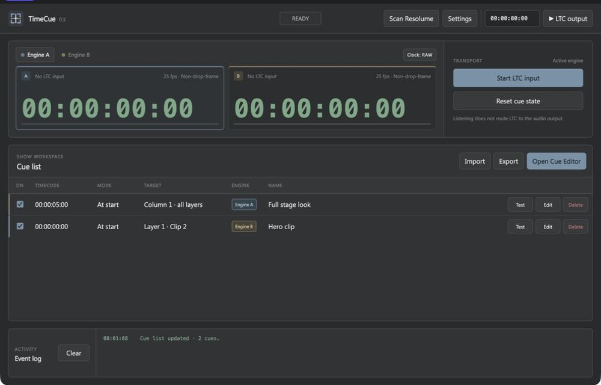
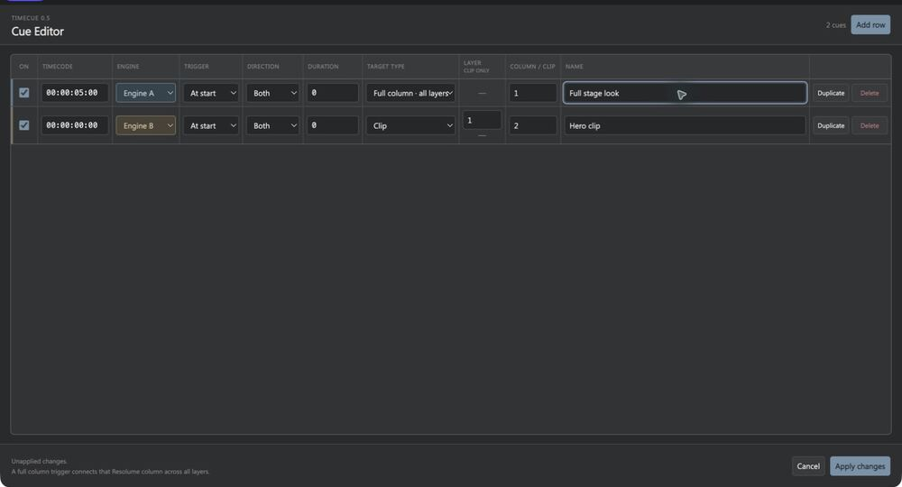
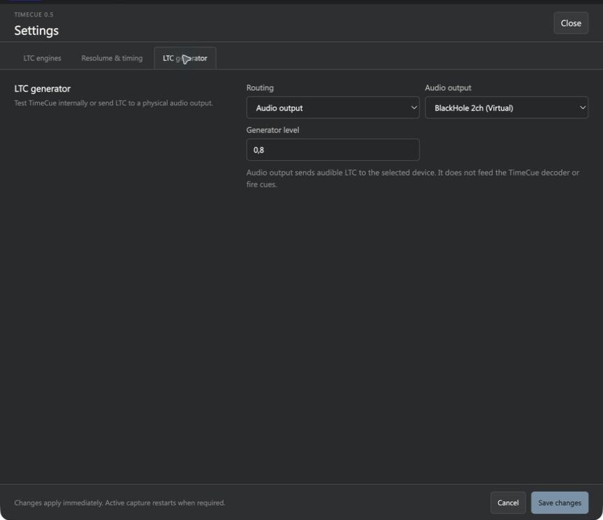
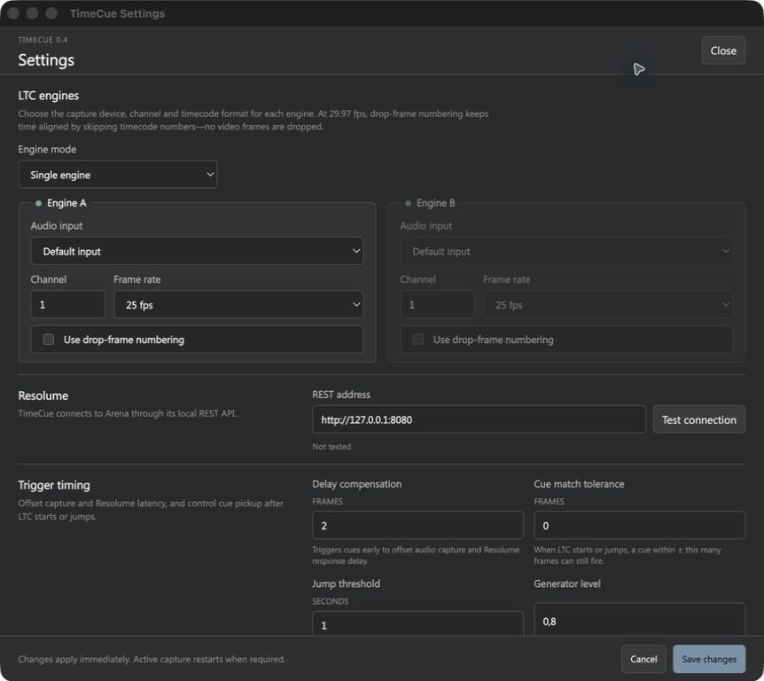

  

<h1 align="center">TimeCue</h1>

  <strong>Reliable LTC and MTC show control for Resolume Arena.</strong> 
  Download the latest tested TimeCue packages for Windows, macOS, Linux and Bitfocus Companion.

  
  
  
  

---

## Latest release

Download **[TimeCue 0.8.4](https://github.com/4H1Mzs/TimeCue-Releases/releases/tag/v0.8.4)** from the Releases page.

- **Windows x64** — per-user NSIS installer with in-app updates. Windows packages are currently unsigned and may show a SmartScreen warning.
- **macOS Intel and Apple Silicon** — signed and notarized DMG and ZIP packages.
- **Linux x64** — portable AppImage.
- **Bitfocus Companion** — offline `.tgz` module package.

The `latest.yml`, `latest-mac.yml` and `latest-linux.yml` files are the public update manifests used by TimeCue. `SHA256SUMS.txt` contains checksums for every published artifact.

## 4H1M

  

4H1M, z.s. is a Czech nonprofit audiovisual production serving churches and Christian events through sound, lighting, visuals, livestreaming and video. TimeCue is developed as part of that work and is shared to support reliable, accessible show control for live productions.

  

[4H1M.com](https://4h1m.com/) · [Instagram @4h1m.production](https://www.instagram.com/4h1m.production/)

## Features

### Two clocks, one clear show state

- One or two independent timecode engines with always-visible clocks
- LTC audio, system MIDI, or native RTP-MIDI source selection independently for each engine
- Separate input device, channel, frame rate, numbering mode, and delay compensation per engine
- 24, 25, 29.97 drop-frame/non-drop-frame, and 30 fps timecode
- Forward and reverse LTC decoding with continuity and discontinuity handling
- Raw or compensated clock display, with an unmistakable amber compensated state

### Cue control made for Resolume

- Trigger a clip by layer and column, or launch a full column across every layer
- `At start`, `At end`, and `During` cue modes
- Per-cue forward, reverse, or bidirectional filtering
- Resolume composition scan and Engine A/B layer assignment
- Manual cue tests, resettable cue state, and an operator-focused event history
- `.timecue` show import and export

### A proper cue-editing workflow

- Fast inline editing of timecode, mode, engine and name in the live cue list
- Dedicated spreadsheet-style Cue Editor window
- Add, insert, duplicate, edit, and validate rows without covering the live monitor
- Explicit Apply/Cancel workflow keeps unfinished edits away from the running show
- Revision checks prevent an older editor draft from overwriting newer inline edits
- Consistent Engine A/B color coding across clocks, live cues, and the editor
- Disabled cues are visibly muted at a glance while remaining available for quick edits

### LTC generation and routing

- Internal loopback for testing the decoder and cue logic
- Audible LTC output to the system default or a selected soundcard
- Start time, frame rate, direction, level, and output routing controls
- Optional local cue triggering while the generator also sends LTC to other devices

### MIDI timecode and network sessions

- MTC quarter-frame transport and full-frame locate messages
- Automatic 24, 25, 29.97 drop-frame and 30 fps detection
- Forward and reverse transport compensation
- Physical and virtual system MIDI ports
- Built-in AppleMIDI/RTP-MIDI session with Bonjour advertisement and discovery
- Incoming invitations, direct hostname/IP connections, and independent peer routing for Engine A/B
- OS-provided RTP-MIDI ports remain available through the system MIDI source
- Quarter-frame fallback when the operating system does not grant SysEx access

### Installation and updates

- Per-user Windows installer with no administrator prompt
- Signed and notarized macOS DMG plus ZIP update payloads
- Linux AppImage distribution
- In-app update check, download progress and explicit restart-to-install on Windows, signed macOS, and Linux builds
- No automatic download, installation or restart during a show

### Bitfocus Companion control

- Live Engine A/B timecode, source, frame rate, direction and signal-health variables
- Overall and per-engine next-cue name, target and countdown
- Generator, input, cue reset, active-engine and clock-display actions
- Signal, transport, countdown and last-cue-result feedbacks
- A coordinated dark preset library ready for Stream Deck and control surfaces

## About TimeCue

TimeCue is a cross-platform desktop companion for timecode-driven Resolume shows. It listens to LTC from an audio interface or MTC from MIDI and RTP-MIDI sessions, keeps raw and compensated clocks visible, and fires precise clip or full-column cues through Resolume Arena's REST API.

The app includes two independent timecode engines, a dedicated cue editor, LTC generation with soundcard output, delay compensation, composition scanning and a Bitfocus Companion integration.

For the complete documentation, screenshots, setup guides and source code, visit the **[main TimeCue repository](https://github.com/4H1Mzs/TimeCue)**.

## Interface

### Live monitor

Both incoming clocks remain visible in dual-engine mode. Selecting an engine only chooses which clock the transport and generator controls; it does not hide the other engine's state.

### Dedicated Cue Editor

The Cue Editor gives each cue a real row with clear dividers, compact controls, and room for show data. Changes stay in a draft until **Apply changes** is selected.

### Generator audio output

Use a muted internal loopback for local tests, or route audible LTC to the system default or a selected physical/virtual audio device. Audio-output mode can also trigger TimeCue's local cues from the same generator timeline.

### Settings and routing

Configure Resolume, timecode sources, delay compensation, generator output, RTP-MIDI and Companion from the dedicated settings window.

---

  <strong>Built for clocks you can trust and cues you can see.</strong> 
  TimeCue is an independent project and is not affiliated with Resolume.

